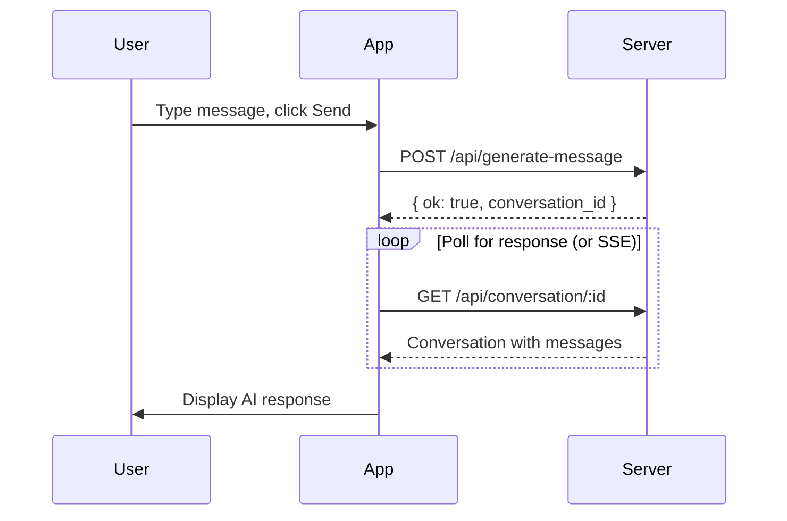

# NanoChat Desktop - Development Overview

A native Linux desktop application for interacting with an AI chat server via API, built with Tauri.

## Technology Stack

| Layer | Technology | Rationale |
|-------|------------|-----------|
| **Framework** | [Tauri 2.x](https://tauri.app/) | Lightweight native apps (~10MB), Rust backend, web-based UI |
| **Backend** | Rust | System integration, secure API calls, config file handling |
| **Frontend** | TypeScript + Svelte | Fast, reactive, minimal boilerplate, excellent DX |
| **UI Components** | Skeleton UI or custom CSS | Modern dark theme, responsive design |
| **Build Tool** | Vite | Fast HMR, ESM-native bundler |
| **Config** | TOML | Rust-native, human-readable |

---

## Development Environment Setup

### Prerequisites (Ubuntu/Debian-based)

```bash
# 1. System dependencies for Tauri
sudo apt update
sudo apt install -y \
    libwebkit2gtk-4.1-dev \
    build-essential \
    curl \
    wget \
    file \
    libxdo-dev \
    libssl-dev \
    libayatana-appindicator3-dev \
    librsvg2-dev

# 2. Install Rust
curl --proto '=https' --tlsv1.2 -sSf https://sh.rustup.rs | sh
source ~/.cargo/env

# 3. Install Node.js (via nvm recommended)
curl -o- https://raw.githubusercontent.com/nvm-sh/nvm/v0.39.7/install.sh | bash
source ~/.bashrc
nvm install 20
nvm use 20

# 4. Verify installations
rustc --version    # Should show 1.75+
node --version     # Should show v20+
npm --version      # Should show 10+
```

### Prerequisites (Fedora/RHEL-based)

```bash
# 1. System dependencies for Tauri
sudo dnf install -y \
    webkit2gtk4.1-devel \
    openssl-devel \
    curl \
    wget \
    file \
    libxdo-devel \
    libappindicator-gtk3-devel \
    librsvg2-devel

# 2-4. Same as Ubuntu (Rust, Node.js, verify)
```

### Prerequisites (Arch-based)

```bash
sudo pacman -S --needed \
    webkit2gtk-4.1 \
    base-devel \
    curl \
    wget \
    file \
    openssl \
    libxdo \
    libappindicator-gtk3 \
    librsvg

# 2-4. Same as Ubuntu (Rust, Node.js, verify)
```

### Project Setup

```bash
cd /home/mark/projects/nanochat-desktop

# Create Tauri + Svelte project
npm create tauri-app@latest . -- --template svelte-ts --manager npm

# Install dependencies
npm install

# Run in development mode
npm run tauri dev
```

---

## Configuration

**Location**: `~/.config/nanochat-desktop/config.toml`

```toml
[server]
url = "https://nano.crocker-family.org"

[auth]
# API key stored securely (created via web UI, pasted here)
api_key = "your-api-key-here"

[ui]
theme = "dark"  # "dark" | "light" | "system"
```

The app will:
1. Check for config file on startup
2. Prompt for server URL and API key if not configured
3. Validate connection before proceeding

---

## Version Roadmap

### 🎯 V1 - Core Chat (MVP)

**Goal**: Basic chat functionality with the API server.

| Feature | Description |
|---------|-------------|
| **Configuration** | First-run setup for server URL and API key |
| **New Chat** | Send messages, receive AI responses |
| **Chat History** | View list of existing conversations |
| **View Conversation** | Open and read past conversations |
| **Model Selection** | Choose AI model for generation |

**API Endpoints Used**:
- `POST /api/generate-message` - Send messages
- `GET /api/conversations` (TBD) - List conversations
- `GET /api/conversation/:id` (TBD) - Get conversation details

> [!NOTE]
> The current API docs don't show conversation listing endpoints. We may need to investigate the server or add polling-based message retrieval.

---

### 🔧 V2 - Enhanced Features

**Goal**: File attachments and assistant customization.

| Feature | Description |
|---------|-------------|
| **File Attachments** | Upload images and documents to chats |
| **Assistant Selection** | Choose from configured assistants |
| **Web Search Toggle** | Enable/disable web search modes |
| **Cancel Generation** | Stop in-progress AI responses |

**API Endpoints Used**:
- `POST /api/storage` - Upload files
- `GET /api/assistants` - List assistants
- `POST /api/cancel-generation` - Cancel in-progress generation

---

### 🚀 V3 - Power Features

**Goal**: Full feature parity with web interface.

| Feature | Description |
|---------|-------------|
| **Projects** | Organize conversations into projects |
| **Create Assistants** | Define custom assistants from desktop |
| **Prompt Enhancement** | Use AI to improve prompts before sending |
| **Keyboard Shortcuts** | Power-user navigation and actions |
| **System Tray** | Background operation with quick access |
| **Notifications** | Desktop notifications for responses |

---

### 🌟 V4+ - Advanced Features

| Feature | Description |
|---------|-------------|
| **Multi-server** | Connect to multiple API servers |
| **Offline Queue** | Queue messages when offline |
| **Export/Import** | Backup conversations locally |
| **Themes** | Custom color themes |
| **Plugins** | Extensibility system |

---

## Project Structure

```
nanochat-desktop/
├── src/                      # Frontend (Svelte + TypeScript)
│   ├── lib/
│   │   ├── components/       # UI components
│   │   │   ├── ChatMessage.svelte
│   │   │   ├── ChatInput.svelte
│   │   │   ├── ConversationList.svelte
│   │   │   └── Settings.svelte
│   │   ├── stores/           # Svelte stores for state
│   │   │   ├── config.ts
│   │   │   ├── conversations.ts
│   │   │   └── chat.ts
│   │   └── api/              # API client functions
│   │       ├── client.ts     # HTTP client wrapper
│   │       ├── messages.ts   # Message generation
│   │       └── types.ts      # TypeScript interfaces
│   ├── routes/               # Page components
│   │   ├── +page.svelte      # Main chat view
│   │   └── settings/
│   │       └── +page.svelte
│   ├── app.html
│   ├── app.css               # Global styles
│   └── main.ts
├── src-tauri/                # Backend (Rust)
│   ├── src/
│   │   ├── main.rs           # Tauri entry point
│   │   ├── config.rs         # Config file handling
│   │   ├── api.rs            # Tauri commands for API calls
│   │   └── lib.rs
│   ├── Cargo.toml
│   └── tauri.conf.json       # Tauri configuration
├── package.json
├── svelte.config.js
├── vite.config.ts
└── tsconfig.json
```

---

## API Integration Approach

### Authentication

The app will use **API Key authentication** via the `Authorization: Bearer <key>` header.

```typescript
// src/lib/api/client.ts
async function apiRequest(endpoint: string, options: RequestInit = {}) {
  const config = await getConfig();
  
  return fetch(`${config.serverUrl}${endpoint}`, {
    ...options,
    headers: {
      'Authorization': `Bearer ${config.apiKey}`,
      'Content-Type': 'application/json',
      ...options.headers,
    },
  });
}
```

### Message Generation Flow



### Response Streaming Strategy

Since we're unsure if the server uses SSE or requires polling:

1. **First attempt**: Try SSE connection to the endpoint
2. **Fallback**: Poll every 500ms until message is complete
3. **Detection**: Check response headers for `text/event-stream`

---

## Verification Plan

### V1 Verification

| Test | Method |
|------|--------|
| App launches | `npm run tauri dev` - window appears |
| Config saves | Check `~/.config/nanochat-desktop/config.toml` exists |
| API connection | Send test message, verify response in UI |
| Conversation list | Verify past chats appear after config |

### Manual Testing Steps

1. Run `npm run tauri dev`
2. Enter server URL and API key on first launch
3. Create a new conversation, send "Hello"
4. Verify AI response appears
5. Close and reopen app
6. Verify conversation appears in history

---

## Open Questions

1. **Conversation retrieval**: The API docs don't show how to list/fetch existing conversations. Need to investigate server endpoints or add this functionality.

2. **Real-time updates**: Need to test if `/api/generate-message` supports SSE or if we need to implement polling.

3. **Model list**: How do we get available models? Need an endpoint like `GET /api/models`.

---

## Next Steps

1. ✅ Review and approve this development plan
2. Set up Tauri project structure
3. Implement configuration system (Rust + UI)
4. Build basic chat UI
5. Integrate with `/api/generate-message`
6. Add conversation history (pending API investigation)
